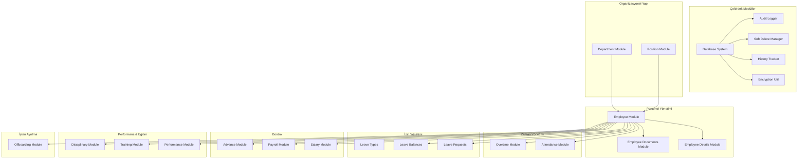

# Tasarım Belgesi

## Genel Bakış

Bu belge, Personel Yönetimi Sistemi veritabanı modüllerinin teknik tasarımını içerir. Sistem, Prisma ORM kullanarak SQLite veritabanı üzerinde çalışacak şekilde tasarlanmıştır. Tasarım; soft delete, audit logging, tarihçeli veri yönetimi ve hassas veri şifreleme prensiplerini temel alır.

### Teknoloji Yığını
- **ORM**: Prisma Client
- **Veritabanı**: SQLite
- **Şifreleme**: Node.js crypto modülü (AES-256-GCM)
- **Validasyon**: Zod schema validation
- **Test**: Jest + fast-check (property-based testing)

## Mimari

### Katmanlı Mimari

```
┌─────────────────────────────────────────────────────────────┐
│                    IPC Handlers (Electron)                   │
├─────────────────────────────────────────────────────────────┤
│                      Service Layer                           │
│  (İş mantığı, validasyon, şifreleme/çözme)                  │
├─────────────────────────────────────────────────────────────┤
│                    Repository Layer                          │
│  (CRUD operasyonları, soft delete, audit log)               │
├─────────────────────────────────────────────────────────────┤
│                      Prisma Client                           │
├─────────────────────────────────────────────────────────────┤
│                    SQLite Database                           │
└─────────────────────────────────────────────────────────────┘
```

### Modül Bağımlılık Diyagramı



## Bileşenler ve Arayüzler

### 1. Temel Bileşenler

#### 1.1 BaseRepository (Soyut Sınıf)
Tüm repository'ler için ortak CRUD operasyonları ve soft delete mantığını sağlar.

```typescript
interface IBaseRepository<T> {
  findAll(includeDeleted?: boolean): Promise<T[]>;
  findById(id: number, includeDeleted?: boolean): Promise<T | null>;
  create(data: Omit<T, 'id' | 'createdAt' | 'updatedAt' | 'deletedAt'>): Promise<T>;
  update(id: number, data: Partial<T>): Promise<T>;
  softDelete(id: number): Promise<T>;
  hardDelete(id: number): Promise<T>; // Sadece admin için
  restore(id: number): Promise<T>;
}
```

#### 1.2 AuditLogger Service
Tüm veri değişikliklerini audit_log tablosuna kaydeder.

```typescript
interface IAuditLogger {
  log(params: {
    tableName: string;
    recordId: number;
    action: 'INSERT' | 'UPDATE' | 'DELETE';
    oldValues?: Record<string, unknown>;
    newValues?: Record<string, unknown>;
    userId?: number;
  }): Promise<void>;
}
```

#### 1.3 EncryptionUtil
Hassas verilerin şifrelenmesi ve çözülmesi için utility.

```typescript
interface IEncryptionUtil {
  encrypt(plainText: string): string;
  decrypt(encryptedText: string): string;
  hash(text: string): string;
}
```

#### 1.4 HistoryTracker Service
Maaş ve departman değişikliklerini tarihçe olarak kaydeder.

```typescript
interface IHistoryTracker {
  trackSalaryChange(employeeId: number, newSalary: SalaryData): Promise<void>;
  trackDepartmentChange(employeeId: number, newDeptId: number, newPosId: number): Promise<void>;
}
```

### 2. Organizasyonel Yapı Bileşenleri

#### 2.1 DepartmentService

```typescript
interface IDepartmentService {
  create(data: CreateDepartmentDto): Promise<Department>;
  update(id: number, data: UpdateDepartmentDto): Promise<Department>;
  delete(id: number): Promise<void>;
  findById(id: number): Promise<Department | null>;
  findAll(): Promise<Department[]>;
  getHierarchy(): Promise<DepartmentTreeNode[]>;
  getChildren(parentId: number): Promise<Department[]>;
  assignManager(departmentId: number, managerId: number): Promise<Department>;
}

interface DepartmentTreeNode {
  id: number;
  name: string;
  managerId: number | null;
  costCenterCode: string | null;
  children: DepartmentTreeNode[];
}
```

#### 2.2 PositionService

```typescript
interface IPositionService {
  create(data: CreatePositionDto): Promise<Position>;
  update(id: number, data: UpdatePositionDto): Promise<Position>;
  delete(id: number): Promise<void>;
  findById(id: number): Promise<Position | null>;
  findByDepartment(departmentId: number): Promise<Position[]>;
  findAll(): Promise<Position[]>;
  validateSalaryRange(positionId: number, salary: number): boolean;
}
```

### 3. Personel Yönetimi Bileşenleri

#### 3.1 EmployeeService

```typescript
interface IEmployeeService {
  create(data: CreateEmployeeDto): Promise<Employee>;
  update(id: number, data: UpdateEmployeeDto): Promise<Employee>;
  delete(id: number): Promise<void>;
  findById(id: number): Promise<Employee | null>;
  findByCode(employeeCode: string): Promise<Employee | null>;
  findAll(filters?: EmployeeFilters): Promise<Employee[]>;
  findByDepartment(departmentId: number): Promise<Employee[]>;
  findByManager(managerId: number): Promise<Employee[]>;
  changeStatus(id: number, status: EmployeeStatus): Promise<Employee>;
  changeDepartment(id: number, departmentId: number, positionId: number): Promise<Employee>;
  generateEmployeeCode(): Promise<string>;
}

type EmployeeStatus = 'Active' | 'Passive' | 'OnLeave' | 'Terminated';
type ContractType = 'Süreli' | 'Süresiz' | 'Stajyer' | 'Freelance';
```

#### 3.2 EmployeeDetailsService

```typescript
interface IEmployeeDetailsService {
  create(employeeId: number, data: CreateEmployeeDetailsDto): Promise<EmployeeDetails>;
  update(employeeId: number, data: UpdateEmployeeDetailsDto): Promise<EmployeeDetails>;
  findByEmployeeId(employeeId: number): Promise<EmployeeDetails | null>;
  getDecryptedDetails(employeeId: number): Promise<DecryptedEmployeeDetails>;
}

interface DecryptedEmployeeDetails extends Omit<EmployeeDetails, 'iban' | 'socialSecurityNumber'> {
  iban: string; // Çözülmüş
  socialSecurityNumber: string; // Çözülmüş
}
```

#### 3.3 EmployeeDocumentsService

```typescript
interface IEmployeeDocumentsService {
  upload(employeeId: number, data: UploadDocumentDto): Promise<EmployeeDocument>;
  delete(documentId: number): Promise<void>;
  findByEmployeeId(employeeId: number): Promise<EmployeeDocument[]>;
  findByType(employeeId: number, type: DocumentType): Promise<EmployeeDocument[]>;
}

type DocumentType = 'Sözleşme' | 'Kimlik Fotokopisi' | 'Diploma' | 'Sağlık Raporu' | 'Diğer';
```

### 4. Zaman Yönetimi Bileşenleri

#### 4.1 AttendanceService

```typescript
interface IAttendanceService {
  checkIn(employeeId: number, time?: Date): Promise<AttendanceLog>;
  checkOut(employeeId: number, time?: Date): Promise<AttendanceLog>;
  setBreakDuration(logId: number, minutes: number): Promise<AttendanceLog>;
  setStatus(logId: number, status: AttendanceStatus): Promise<AttendanceLog>;
  findByEmployee(employeeId: number, dateRange: DateRange): Promise<AttendanceLog[]>;
  findByDate(date: Date): Promise<AttendanceLog[]>;
  bulkCreate(records: BulkAttendanceDto[]): Promise<AttendanceLog[]>;
  calculateWorkingHours(log: AttendanceLog): number;
  getMonthlyReport(employeeId: number, month: number, year: number): Promise<MonthlyAttendanceReport>;
}

type AttendanceStatus = 'Geldi' | 'Gelmedi' | 'İzinli' | 'Tatil';
```

#### 4.2 OvertimeService

```typescript
interface IOvertimeService {
  create(data: CreateOvertimeDto): Promise<Overtime>;
  approve(id: number, approverId: number): Promise<Overtime>;
  reject(id: number, approverId: number): Promise<Overtime>;
  findByEmployee(employeeId: number, dateRange?: DateRange): Promise<Overtime[]>;
  findPending(): Promise<Overtime[]>;
  calculateOvertimePay(overtime: Overtime, hourlyRate: number): number;
}
```

### 5. İzin Yönetimi Bileşenleri

#### 5.1 LeaveTypeService

```typescript
interface ILeaveTypeService {
  create(data: CreateLeaveTypeDto): Promise<LeaveType>;
  update(id: number, data: UpdateLeaveTypeDto): Promise<LeaveType>;
  delete(id: number): Promise<void>;
  findAll(): Promise<LeaveType[]>;
  seedDefaults(): Promise<void>;
}
```

#### 5.2 LeaveRequestService

```typescript
interface ILeaveRequestService {
  create(data: CreateLeaveRequestDto): Promise<LeaveRequest>;
  approve(id: number, approverId: number): Promise<LeaveRequest>;
  reject(id: number, approverId: number): Promise<LeaveRequest>;
  cancel(id: number): Promise<LeaveRequest>;
  findByEmployee(employeeId: number): Promise<LeaveRequest[]>;
  findPending(): Promise<LeaveRequest[]>;
  findByDateRange(startDate: Date, endDate: Date): Promise<LeaveRequest[]>;
  calculateDayCount(startDate: Date, endDate: Date, isHalfDay?: boolean): number;
  checkOverlap(employeeId: number, startDate: Date, endDate: Date): Promise<boolean>;
}
```

#### 5.3 LeaveBalanceService

```typescript
interface ILeaveBalanceService {
  create(employeeId: number, year: number): Promise<LeaveBalance>;
  getBalance(employeeId: number, year: number): Promise<LeaveBalance | null>;
  deductDays(employeeId: number, year: number, days: number): Promise<LeaveBalance>;
  addDays(employeeId: number, year: number, days: number): Promise<LeaveBalance>;
  transferToNextYear(employeeId: number, fromYear: number): Promise<LeaveBalance>;
  calculateEntitlement(employeeId: number, year: number): number;
  initializeYearlyBalances(year: number): Promise<void>;
}
```

### 6. Bordro Bileşenleri

#### 6.1 SalaryService

```typescript
interface ISalaryService {
  create(employeeId: number, data: CreateSalaryDto): Promise<SalaryHistory>;
  getCurrentSalary(employeeId: number): Promise<SalaryHistory | null>;
  getHistory(employeeId: number): Promise<SalaryHistory[]>;
  updateSalary(employeeId: number, newAmount: number, effectiveDate: Date): Promise<SalaryHistory>;
}
```

#### 6.2 PayrollService

```typescript
interface IPayrollService {
  generate(employeeId: number, month: number, year: number): Promise<Payroll>;
  generateBulk(month: number, year: number): Promise<Payroll[]>;
  finalize(payrollId: number): Promise<Payroll>;
  addItem(payrollId: number, item: CreatePayrollItemDto): Promise<PayrollItem>;
  removeItem(itemId: number): Promise<void>;
  calculateNetSalary(payroll: Payroll): number;
  getByEmployee(employeeId: number, year: number): Promise<Payroll[]>;
  getByPeriod(month: number, year: number): Promise<Payroll[]>;
}
```

#### 6.3 AdvanceService

```typescript
interface IAdvanceService {
  request(employeeId: number, data: CreateAdvanceDto): Promise<SalaryAdvance>;
  approve(id: number, approverId: number, deductionPeriod: string): Promise<SalaryAdvance>;
  reject(id: number, approverId: number): Promise<SalaryAdvance>;
  markAsPaid(id: number, paymentDate: Date): Promise<SalaryAdvance>;
  markAsDeducted(id: number): Promise<SalaryAdvance>;
  findByEmployee(employeeId: number): Promise<SalaryAdvance[]>;
  findPending(): Promise<SalaryAdvance[]>;
  findByDeductionPeriod(period: string): Promise<SalaryAdvance[]>;
  validateAmount(employeeId: number, amount: number): Promise<boolean>;
}
```

### 7. Performans ve Eğitim Bileşenleri

#### 7.1 PerformanceService

```typescript
interface IPerformanceService {
  create(data: CreatePerformanceReviewDto): Promise<PerformanceReview>;
  update(id: number, data: UpdatePerformanceReviewDto): Promise<PerformanceReview>;
  submit(id: number): Promise<PerformanceReview>;
  acknowledge(id: number): Promise<PerformanceReview>;
  findByEmployee(employeeId: number): Promise<PerformanceReview[]>;
  findByReviewer(reviewerId: number): Promise<PerformanceReview[]>;
  findByPeriod(period: string): Promise<PerformanceReview[]>;
}
```

#### 7.2 TrainingService

```typescript
interface ITrainingService {
  createTraining(data: CreateTrainingDto): Promise<Training>;
  updateTraining(id: number, data: UpdateTrainingDto): Promise<Training>;
  deleteTraining(id: number): Promise<void>;
  assignEmployee(trainingId: number, employeeId: number): Promise<EmployeeTraining>;
  completeTraining(employeeTrainingId: number, certificateUrl?: string): Promise<EmployeeTraining>;
  failTraining(employeeTrainingId: number): Promise<EmployeeTraining>;
  findAllTrainings(): Promise<Training[]>;
  findEmployeeTrainings(employeeId: number): Promise<EmployeeTraining[]>;
}
```

#### 7.3 DisciplinaryService

```typescript
interface IDisciplinaryService {
  create(data: CreateDisciplinaryActionDto): Promise<DisciplinaryAction>;
  update(id: number, data: UpdateDisciplinaryActionDto): Promise<DisciplinaryAction>;
  findByEmployee(employeeId: number): Promise<DisciplinaryAction[]>;
  findByViolationType(type: ViolationType): Promise<DisciplinaryAction[]>;
}

type ViolationType = 'İşe Geç Kalma' | 'İş Güvenliği İhlali' | 'Devamsızlık' | 'Görev İhmali' | 'Diğer';
type ActionTaken = 'Sözlü Uyarı' | 'Yazılı Uyarı' | 'Tutanak' | 'Maaş Kesintisi' | 'İşten Çıkarma';
```

### 8. İşten Ayrılma Bileşenleri

#### 8.1 OffboardingService

```typescript
interface IOffboardingService {
  createResignation(data: CreateResignationDto): Promise<Resignation>;
  approveResignation(id: number): Promise<Resignation>;
  completeResignation(id: number): Promise<Resignation>;
  createExitInterview(resignationId: number, data: CreateExitInterviewDto): Promise<ExitInterview>;
  findByEmployee(employeeId: number): Promise<Resignation | null>;
  findPending(): Promise<Resignation[]>;
  calculateFinalSettlement(resignationId: number): Promise<FinalSettlement>;
}

type ReasonCategory = 'İstifa' | 'Emeklilik' | 'Çıkarılma' | 'Sözleşme Bitimi';

interface FinalSettlement {
  remainingLeaveDays: number;
  leavePayoutAmount: number;
  pendingAdvances: number;
  netSettlement: number;
}
```

### 9. Ayarlar Bileşeni

#### 9.1 SettingsService

```typescript
interface ISettingsService {
  get(key: string): Promise<string | null>;
  set(key: string, value: string, group?: string): Promise<AppSetting>;
  getByGroup(group: string): Promise<AppSetting[]>;
  getAll(): Promise<AppSetting[]>;
  seedDefaults(): Promise<void>;
}
```

## Veri Modelleri

### Prisma Schema Tasarımı

#### Temel Alanlar (Tüm Modellerde)

```prisma
// Her modelde bulunacak ortak alanlar
createdAt DateTime @default(now()) @map("created_at")
updatedAt DateTime @updatedAt @map("updated_at")
deletedAt DateTime? @map("deleted_at") // Soft delete için
```

#### Organizasyonel Yapı Modelleri

```prisma
model Department {
  id                 Int          @id @default(autoincrement())
  name               String
  managerId          Int?         @map("manager_id")
  parentDepartmentId Int?         @map("parent_department_id")
  costCenterCode     String?      @unique @map("cost_center_code")
  createdAt          DateTime     @default(now()) @map("created_at")
  updatedAt          DateTime     @updatedAt @map("updated_at")
  deletedAt          DateTime?    @map("deleted_at")

  manager            Employee?    @relation("DepartmentManager", fields: [managerId], references: [id])
  parentDepartment   Department?  @relation("DepartmentHierarchy", fields: [parentDepartmentId], references: [id])
  childDepartments   Department[] @relation("DepartmentHierarchy")
  employees          Employee[]   @relation("EmployeeDepartment")
  positions          Position[]

  @@unique([name, parentDepartmentId])
  @@map("departments")
}

model Position {
  id             Int        @id @default(autoincrement())
  title          String
  departmentId   Int        @map("department_id")
  jobDescription String?    @map("job_description")
  baseSalaryMin  Float?     @map("base_salary_min")
  baseSalaryMax  Float?     @map("base_salary_max")
  createdAt      DateTime   @default(now()) @map("created_at")
  updatedAt      DateTime   @updatedAt @map("updated_at")
  deletedAt      DateTime?  @map("deleted_at")

  department     Department @relation(fields: [departmentId], references: [id])
  employees      Employee[]

  @@unique([title, departmentId])
  @@map("positions")
}
```

#### Personel Modelleri

```prisma
model Employee {
  id            Int       @id @default(autoincrement())
  employeeCode  String    @unique @map("employee_code")
  firstName     String    @map("first_name")
  lastName      String    @map("last_name")
  identityNumber String   @map("identity_number") // Şifreli
  emailWork     String?   @unique @map("email_work")
  emailPersonal String?   @map("email_personal")
  phonePrimary  String?   @map("phone_primary")
  photoUrl      String?   @map("photo_url")
  departmentId  Int       @map("department_id")
  positionId    Int       @map("position_id")
  managerId     Int?      @map("manager_id")
  hireDate      DateTime  @map("hire_date")
  contractType  String    @map("contract_type") // Süreli, Süresiz, Stajyer, Freelance
  status        String    @default("Active") // Active, Passive, OnLeave, Terminated
  createdAt     DateTime  @default(now()) @map("created_at")
  updatedAt     DateTime  @updatedAt @map("updated_at")
  deletedAt     DateTime? @map("deleted_at")

  department           Department          @relation("EmployeeDepartment", fields: [departmentId], references: [id])
  position             Position            @relation(fields: [positionId], references: [id])
  manager              Employee?           @relation("EmployeeManager", fields: [managerId], references: [id])
  subordinates         Employee[]          @relation("EmployeeManager")
  managedDepartments   Department[]        @relation("DepartmentManager")
  details              EmployeeDetails?
  documents            EmployeeDocument[]
  attendanceLogs       AttendanceLog[]
  overtimes            Overtime[]
  overtimeApprovals    Overtime[]          @relation("OvertimeApprover")
  leaveRequests        LeaveRequest[]
  leaveApprovals       LeaveRequest[]      @relation("LeaveApprover")
  leaveBalances        LeaveBalance[]
  salaryHistory        SalaryHistory[]
  payrolls             Payroll[]
  advances             SalaryAdvance[]
  performanceReviews   PerformanceReview[] @relation("ReviewedEmployee")
  givenReviews         PerformanceReview[] @relation("Reviewer")
  trainings            EmployeeTraining[]
  disciplinaryActions  DisciplinaryAction[]
  resignations         Resignation[]

  @@map("employees")
}
```

```prisma
model EmployeeDetails {
  id                    Int       @id @default(autoincrement())
  employeeId            Int       @unique @map("employee_id")
  birthDate             DateTime? @map("birth_date")
  bloodGroup            String?   @map("blood_group")
  gender                String?
  maritalStatus         String?   @map("marital_status")
  addressHome           String?   @map("address_home")
  emergencyContactName  String?   @map("emergency_contact_name")
  emergencyContactPhone String?   @map("emergency_contact_phone")
  bankName              String?   @map("bank_name")
  iban                  String?   // Şifreli
  socialSecurityNumber  String?   @map("social_security_number") // Şifreli
  educationLevel        String?   @map("education_level")
  militaryStatus        String?   @map("military_status")
  createdAt             DateTime  @default(now()) @map("created_at")
  updatedAt             DateTime  @updatedAt @map("updated_at")

  employee              Employee  @relation(fields: [employeeId], references: [id])

  @@map("employee_details")
}

model EmployeeDocument {
  id           Int       @id @default(autoincrement())
  employeeId   Int       @map("employee_id")
  documentType String    @map("document_type")
  filePath     String    @map("file_path")
  uploadDate   DateTime  @default(now()) @map("upload_date")
  createdAt    DateTime  @default(now()) @map("created_at")
  updatedAt    DateTime  @updatedAt @map("updated_at")
  deletedAt    DateTime? @map("deleted_at")

  employee     Employee  @relation(fields: [employeeId], references: [id])

  @@map("employee_documents")
}
```

#### Zaman Yönetimi Modelleri

```prisma
model AttendanceLog {
  id            Int       @id @default(autoincrement())
  employeeId    Int       @map("employee_id")
  date          DateTime
  checkInTime   DateTime? @map("check_in_time")
  checkOutTime  DateTime? @map("check_out_time")
  breakDuration Int       @default(0) @map("break_duration") // dakika
  status        String    @default("Geldi") // Geldi, Gelmedi, İzinli, Tatil
  dailyNote     String?   @map("daily_note")
  createdAt     DateTime  @default(now()) @map("created_at")
  updatedAt     DateTime  @updatedAt @map("updated_at")
  deletedAt     DateTime? @map("deleted_at")

  employee      Employee  @relation(fields: [employeeId], references: [id])

  @@unique([employeeId, date])
  @@map("attendance_logs")
}

model Overtime {
  id             Int       @id @default(autoincrement())
  employeeId     Int       @map("employee_id")
  date           DateTime
  hours          Float
  multiplier     Float     @default(1.5)
  description    String?
  approvalStatus String    @default("Pending") @map("approval_status")
  approvedBy     Int?      @map("approved_by")
  createdAt      DateTime  @default(now()) @map("created_at")
  updatedAt      DateTime  @updatedAt @map("updated_at")
  deletedAt      DateTime? @map("deleted_at")

  employee       Employee  @relation(fields: [employeeId], references: [id])
  approver       Employee? @relation("OvertimeApprover", fields: [approvedBy], references: [id])

  @@map("overtimes")
}
```

#### İzin Yönetimi Modelleri

```prisma
model LeaveType {
  id                Int       @id @default(autoincrement())
  name              String    @unique
  isPaid            Boolean   @default(true) @map("is_paid")
  deductsFromAnnual Boolean   @default(false) @map("deducts_from_annual")
  limitDays         Int?      @map("limit_days")
  createdAt         DateTime  @default(now()) @map("created_at")
  updatedAt         DateTime  @updatedAt @map("updated_at")
  deletedAt         DateTime? @map("deleted_at")

  leaveRequests     LeaveRequest[]

  @@map("leave_types")
}

model LeaveRequest {
  id          Int       @id @default(autoincrement())
  employeeId  Int       @map("employee_id")
  leaveTypeId Int       @map("leave_type_id")
  startDate   DateTime  @map("start_date")
  endDate     DateTime  @map("end_date")
  dayCount    Float     @map("day_count")
  returnDate  DateTime? @map("return_date")
  reason      String?
  status      String    @default("Pending") // Pending, Approved, Rejected
  approvedBy  Int?      @map("approved_by")
  createdAt   DateTime  @default(now()) @map("created_at")
  updatedAt   DateTime  @updatedAt @map("updated_at")
  deletedAt   DateTime? @map("deleted_at")

  employee    Employee  @relation(fields: [employeeId], references: [id])
  leaveType   LeaveType @relation(fields: [leaveTypeId], references: [id])
  approver    Employee? @relation("LeaveApprover", fields: [approvedBy], references: [id])

  @@map("leave_requests")
}

model LeaveBalance {
  id                     Int      @id @default(autoincrement())
  employeeId             Int      @map("employee_id")
  year                   Int
  annualLeaveEntitlement Int      @map("annual_leave_entitlement")
  transferredDays        Int      @default(0) @map("transferred_days")
  usedDays               Float    @default(0) @map("used_days")
  remainingDays          Float    @map("remaining_days") // Hesaplanan
  createdAt              DateTime @default(now()) @map("created_at")
  updatedAt              DateTime @updatedAt @map("updated_at")

  employee               Employee @relation(fields: [employeeId], references: [id])

  @@unique([employeeId, year])
  @@map("leave_balances")
}
```

#### Bordro Modelleri

```prisma
model SalaryHistory {
  id         Int       @id @default(autoincrement())
  employeeId Int       @map("employee_id")
  amount     Float
  currency   String    @default("TRY")
  periodType String    @default("Aylık") @map("period_type")
  startDate  DateTime  @map("start_date")
  endDate    DateTime? @map("end_date")
  createdAt  DateTime  @default(now()) @map("created_at")
  updatedAt  DateTime  @updatedAt @map("updated_at")

  employee   Employee  @relation(fields: [employeeId], references: [id])

  @@map("salary_history")
}

model Payroll {
  id              Int           @id @default(autoincrement())
  employeeId      Int           @map("employee_id")
  periodMonth     Int           @map("period_month")
  periodYear      Int           @map("period_year")
  baseSalary      Float         @map("base_salary")
  totalAdditions  Float         @default(0) @map("total_additions")
  totalDeductions Float         @default(0) @map("total_deductions")
  netSalary       Float         @map("net_salary")
  isFinalized     Boolean       @default(false) @map("is_finalized")
  createdAt       DateTime      @default(now()) @map("created_at")
  updatedAt       DateTime      @updatedAt @map("updated_at")
  deletedAt       DateTime?     @map("deleted_at")

  employee        Employee      @relation(fields: [employeeId], references: [id])
  items           PayrollItem[]

  @@unique([employeeId, periodMonth, periodYear])
  @@map("payrolls")
}

model PayrollItem {
  id          Int      @id @default(autoincrement())
  payrollId   Int      @map("payroll_id")
  type        String   // Income, Deduction
  category    String   // Overtime, Bonus, Tax, Insurance, Advance, etc.
  description String?
  amount      Float
  createdAt   DateTime @default(now()) @map("created_at")
  updatedAt   DateTime @updatedAt @map("updated_at")

  payroll     Payroll  @relation(fields: [payrollId], references: [id])

  @@map("payroll_items")
}

model SalaryAdvance {
  id              Int       @id @default(autoincrement())
  employeeId      Int       @map("employee_id")
  requestDate     DateTime  @default(now()) @map("request_date")
  amount          Float
  status          String    @default("Pending") // Pending, Approved, Rejected, Paid, Deducted
  paymentDate     DateTime? @map("payment_date")
  deductionPeriod String?   @map("deduction_period") // YYYY-MM format
  createdAt       DateTime  @default(now()) @map("created_at")
  updatedAt       DateTime  @updatedAt @map("updated_at")
  deletedAt       DateTime? @map("deleted_at")

  employee        Employee  @relation(fields: [employeeId], references: [id])

  @@map("salary_advances")
}
```

#### Performans ve Eğitim Modelleri

```prisma
model PerformanceReview {
  id           Int       @id @default(autoincrement())
  employeeId   Int       @map("employee_id")
  reviewerId   Int       @map("reviewer_id")
  reviewPeriod String    @map("review_period")
  score        Float?
  feedback     String?
  status       String    @default("Draft") // Draft, Submitted, Acknowledged
  createdAt    DateTime  @default(now()) @map("created_at")
  updatedAt    DateTime  @updatedAt @map("updated_at")
  deletedAt    DateTime? @map("deleted_at")

  employee     Employee  @relation("ReviewedEmployee", fields: [employeeId], references: [id])
  reviewer     Employee  @relation("Reviewer", fields: [reviewerId], references: [id])

  @@map("performance_reviews")
}

model Training {
  id            Int                @id @default(autoincrement())
  title         String
  provider      String?
  durationHours Int                @map("duration_hours")
  category      String?
  createdAt     DateTime           @default(now()) @map("created_at")
  updatedAt     DateTime           @updatedAt @map("updated_at")
  deletedAt     DateTime?          @map("deleted_at")

  employeeTrainings EmployeeTraining[]

  @@map("trainings")
}

model EmployeeTraining {
  id             Int       @id @default(autoincrement())
  employeeId     Int       @map("employee_id")
  trainingId     Int       @map("training_id")
  completionDate DateTime? @map("completion_date")
  status         String    @default("Planned") // Planned, Completed, Failed
  certificateUrl String?   @map("certificate_url")
  createdAt      DateTime  @default(now()) @map("created_at")
  updatedAt      DateTime  @updatedAt @map("updated_at")

  employee       Employee  @relation(fields: [employeeId], references: [id])
  training       Training  @relation(fields: [trainingId], references: [id])

  @@map("employee_trainings")
}

model DisciplinaryAction {
  id            Int       @id @default(autoincrement())
  employeeId    Int       @map("employee_id")
  incidentDate  DateTime  @map("incident_date")
  violationType String    @map("violation_type")
  actionTaken   String    @map("action_taken")
  defense       String?
  documentPath  String?   @map("document_path")
  createdAt     DateTime  @default(now()) @map("created_at")
  updatedAt     DateTime  @updatedAt @map("updated_at")
  deletedAt     DateTime? @map("deleted_at")

  employee      Employee  @relation(fields: [employeeId], references: [id])

  @@map("disciplinary_actions")
}
```

#### İşten Ayrılma Modelleri

```prisma
model Resignation {
  id             Int            @id @default(autoincrement())
  employeeId     Int            @map("employee_id")
  requestDate    DateTime       @default(now()) @map("request_date")
  reasonCategory String         @map("reason_category")
  reasonDetail   String?        @map("reason_detail")
  lastWorkingDay DateTime?      @map("last_working_day")
  status         String         @default("Pending") // Pending, Approved, Completed
  createdAt      DateTime       @default(now()) @map("created_at")
  updatedAt      DateTime       @updatedAt @map("updated_at")
  deletedAt      DateTime?      @map("deleted_at")

  employee       Employee       @relation(fields: [employeeId], references: [id])
  exitInterview  ExitInterview?

  @@map("resignations")
}

model ExitInterview {
  id            Int         @id @default(autoincrement())
  resignationId Int         @unique @map("resignation_id")
  comments      String?
  wouldRehire   Boolean?    @map("would_rehire")
  createdAt     DateTime    @default(now()) @map("created_at")
  updatedAt     DateTime    @updatedAt @map("updated_at")

  resignation   Resignation @relation(fields: [resignationId], references: [id])

  @@map("exit_interviews")
}
```

#### Sistem Modelleri

```prisma
model AppSetting {
  id        Int      @id @default(autoincrement())
  key       String   @unique
  value     String
  group     String?
  createdAt DateTime @default(now()) @map("created_at")
  updatedAt DateTime @updatedAt @map("updated_at")

  @@map("app_settings")
}

model AuditLog {
  id        Int      @id @default(autoincrement())
  tableName String   @map("table_name")
  recordId  Int      @map("record_id")
  action    String   // INSERT, UPDATE, DELETE
  oldValues String?  @map("old_values") // JSON
  newValues String?  @map("new_values") // JSON
  userId    Int?     @map("user_id")
  timestamp DateTime @default(now())

  @@map("audit_logs")
}
```

## Doğruluk Özellikleri (Correctness Properties)

*Bir özellik (property), sistemin tüm geçerli yürütmelerinde doğru olması gereken bir davranış veya karakteristiktir. Özellikler, insan tarafından okunabilir spesifikasyonlar ile makine tarafından doğrulanabilir doğruluk garantileri arasında köprü görevi görür.*

### Property 1: Soft Delete Round-Trip

*Herhangi bir* kayıt için, soft delete işlemi sonrası kayıt fiziksel olarak silinmemeli, `deleted_at` alanı set edilmeli ve varsayılan sorgularda görünmemeli, ancak `includeDeleted=true` ile sorgulandığında erişilebilir olmalıdır.

**Validates: Requirements 1.1, 1.2, 1.3**

### Property 2: Audit Timestamp Consistency

*Herhangi bir* kayıt için, oluşturulduğunda `created_at` otomatik set edilmeli, güncellendiğinde `updated_at` değişmeli ve `created_at` hiçbir zaman değişmemelidir.

**Validates: Requirements 1.4, 1.5, 1.6**

### Property 3: Audit Log Completeness

*Herhangi bir* veri değişikliği (INSERT, UPDATE, DELETE) için, audit_log tablosunda tablo adı, kayıt ID, aksiyon tipi, eski değerler, yeni değerler ve kullanıcı ID içeren bir kayıt oluşturulmalıdır.

**Validates: Requirements 1.7**

### Property 4: Sensitive Data Encryption Round-Trip

*Herhangi bir* hassas veri (identity_number, iban, social_security_number) için, şifreleme sonrası çözme işlemi orijinal değeri döndürmelidir: `decrypt(encrypt(x)) == x`

**Validates: Requirements 1.9, 4.5, 5.3, 5.4**

### Property 5: Salary History Preservation

*Herhangi bir* maaş değişikliği için, önceki maaş kaydı korunmalı (end_date set edilmeli) ve yeni kayıt oluşturulmalıdır. Hiçbir maaş kaydı üzerine yazılmamalıdır.

**Validates: Requirements 1.8, 12.4, 12.8**

### Property 6: Department Hierarchy Integrity

*Herhangi bir* departman hiyerarşisi için, getHierarchy() fonksiyonu tüm alt departmanları içeren tam ağaç yapısını döndürmelidir. Alt departmanı olan bir departman soft-delete edilememeli.

**Validates: Requirements 2.3, 2.4, 2.6**

### Property 7: Department Name Uniqueness Within Parent

*Herhangi bir* parent departman için, aynı isimde iki alt departman oluşturulamamalıdır.

**Validates: Requirements 2.2**

### Property 8: Position Salary Range Validity

*Herhangi bir* pozisyon için, `base_salary_min <= base_salary_max` koşulu her zaman sağlanmalıdır.

**Validates: Requirements 3.3**

### Property 9: Employee Code Uniqueness

*Herhangi bir* personel için, employee_code soft-deleted kayıtlar dahil tüm kayıtlar arasında benzersiz olmalıdır.

**Validates: Requirements 4.2, 4.3**

### Property 10: TC Identity Number Validation

*Herhangi bir* geçerli TC Kimlik No için, 11 haneli olmalı ve checksum algoritması doğrulanmalıdır. Geçersiz numaralar reddedilmelidir.

**Validates: Requirements 4.4**

### Property 11: Enum Value Enforcement

*Herhangi bir* enum alanı için (contract_type, status, blood_group, gender, marital_status, military_status, document_type, attendance_status, approval_status, leave_status, violation_type, action_taken, reason_category), sadece tanımlı değerler kabul edilmelidir.

**Validates: Requirements 4.6, 4.7, 5.5, 5.6, 5.7, 5.8, 6.2, 7.3, 8.2, 10.2, 15.2, 16.2, 17.3, 18.2, 18.3, 19.2, 19.3**

### Property 12: IBAN Format Validation

*Herhangi bir* Türk IBAN'ı için, "TR" ile başlamalı ve ardından 24 rakam gelmelidir. Geçersiz formatlar reddedilmelidir.

**Validates: Requirements 5.9**

### Property 13: One-to-One Relationship Enforcement

*Herhangi bir* personel için, employee_details tablosunda en fazla bir kayıt olabilir. İkinci kayıt oluşturma girişimi reddedilmelidir.

**Validates: Requirements 5.2**

### Property 14: Attendance Time Ordering

*Herhangi bir* puantaj kaydı için, check_out_time sağlandığında check_in_time'dan sonra olmalıdır.

**Validates: Requirements 7.4**

### Property 15: Attendance Uniqueness Per Day

*Herhangi bir* personel ve tarih kombinasyonu için, en fazla bir puantaj kaydı olabilir.

**Validates: Requirements 7.2**

### Property 16: Working Hours Calculation

*Herhangi bir* puantaj kaydı için, çalışma saati = (check_out_time - check_in_time) - break_duration formülü ile doğru hesaplanmalıdır.

**Validates: Requirements 7.6**

### Property 17: Overtime Multiplier Range

*Herhangi bir* fazla mesai kaydı için, multiplier değeri 1.0 ile 3.0 arasında olmalıdır.

**Validates: Requirements 8.3**

### Property 18: Overtime Hours Range

*Herhangi bir* fazla mesai kaydı için, hours değeri 0'dan büyük ve 24'ten küçük veya eşit olmalıdır.

**Validates: Requirements 8.6**

### Property 19: Overtime Pay Calculation

*Herhangi bir* onaylanmış fazla mesai için, ödeme = hours × multiplier × hourly_rate formülü ile doğru hesaplanmalıdır.

**Validates: Requirements 8.5**

### Property 20: Leave Day Count Calculation

*Herhangi bir* izin talebi için, day_count = (end_date - start_date + 1) formülü ile doğru hesaplanmalıdır (yarım gün desteği dahil).

**Validates: Requirements 10.3, 10.4**

### Property 21: Leave Date Ordering

*Herhangi bir* izin talebi için, end_date >= start_date koşulu sağlanmalıdır.

**Validates: Requirements 10.8**

### Property 22: Leave Overlap Prevention

*Herhangi bir* personel için, onaylanmış izin talepleri tarih olarak çakışmamalıdır.

**Validates: Requirements 10.9**

### Property 23: Leave Balance Calculation

*Herhangi bir* izin bakiyesi için, remaining_days = annual_leave_entitlement + transferred_days - used_days formülü ile doğru hesaplanmalıdır.

**Validates: Requirements 11.4**

### Property 24: Leave Balance Deduction on Approval

*Herhangi bir* onaylanan izin talebi için, ilgili bakiye kaydındaki used_days otomatik olarak artırılmalıdır.

**Validates: Requirements 10.6, 11.7**

### Property 25: Current Salary Identification

*Herhangi bir* personel için, end_date = null olan maaş kaydı güncel maaş olarak kabul edilmelidir.

**Validates: Requirements 12.5, 12.7**

### Property 26: Positive Amount Validation

*Herhangi bir* parasal değer (salary amount, payroll amounts, advance amount, payroll item amount) için, değer pozitif olmalıdır.

**Validates: Requirements 12.6, 14.6, 15.5**

### Property 27: Net Salary Calculation

*Herhangi bir* bordro için, net_salary = base_salary + total_additions - total_deductions formülü ile doğru hesaplanmalıdır.

**Validates: Requirements 13.3**

### Property 28: Finalized Payroll Immutability

*Herhangi bir* kesinleşmiş (is_finalized=true) bordro için, hiçbir alan değiştirilemez ve yeni kalem eklenemez.

**Validates: Requirements 13.4, 14.7**

### Property 29: Payroll Period Uniqueness

*Herhangi bir* personel için, aynı ay ve yıl kombinasyonunda en fazla bir bordro kaydı olabilir.

**Validates: Requirements 13.2**

### Property 30: Payroll Totals Auto-Update

*Herhangi bir* bordro kalemi eklendiğinde veya silindiğinde, parent bordronun total_additions ve total_deductions değerleri otomatik güncellenmelidir.

**Validates: Requirements 14.5**

### Property 31: Pending Advance Limit

*Herhangi bir* personel için, aynı anda en fazla bir bekleyen (Pending) avans talebi olabilir.

**Validates: Requirements 15.7**

### Property 32: Performance Score Range

*Herhangi bir* performans değerlendirmesi için, score değeri 0 ile 100 arasında olmalıdır.

**Validates: Requirements 16.3**

### Property 33: Self-Review Prevention

*Herhangi bir* performans değerlendirmesi için, reviewer_id != employee_id koşulu sağlanmalıdır.

**Validates: Requirements 16.4**

### Property 34: Submitted Review Immutability

*Herhangi bir* gönderilmiş (status=Submitted) performans değerlendirmesi için, sadece status alanı Acknowledged'a değiştirilebilir, diğer alanlar değiştirilemez.

**Validates: Requirements 16.5**

### Property 35: Training Duration Positivity

*Herhangi bir* eğitim için, duration_hours pozitif bir tam sayı olmalıdır.

**Validates: Requirements 17.6**

### Property 36: Completed Training Date Requirement

*Herhangi bir* tamamlanmış (status=Completed) eğitim kaydı için, completion_date zorunlu olmalıdır.

**Validates: Requirements 17.4**

### Property 37: Resignation Status Transition

*Herhangi bir* onaylanan ayrılma için, personelin status'u last_working_day'de Terminated olarak güncellenmelidir.

**Validates: Requirements 19.4**

### Property 38: Exit Interview One-to-One

*Herhangi bir* ayrılma kaydı için, en fazla bir çıkış mülakatı kaydı olabilir.

**Validates: Requirements 19.6**

### Property 39: Settings Key Uniqueness

*Herhangi bir* ayar için, key değeri benzersiz olmalıdır.

**Validates: Requirements 20.2**

### Property 40: Settings Change Audit

*Herhangi bir* ayar güncellemesi için, audit_log tablosunda eski ve yeni değerleri içeren bir kayıt oluşturulmalıdır.

**Validates: Requirements 20.5**

## Hata Yönetimi

### Hata Kategorileri

#### 1. Validasyon Hataları (ValidationError)
- Geçersiz enum değerleri
- Format hataları (TC Kimlik, IBAN)
- Aralık dışı değerler (score, multiplier, hours)
- Zorunlu alan eksiklikleri

```typescript
class ValidationError extends Error {
  constructor(
    public field: string,
    public value: unknown,
    public constraint: string
  ) {
    super(`Validation failed for ${field}: ${constraint}`);
  }
}
```

#### 2. İş Kuralı Hataları (BusinessRuleError)
- Benzersizlik ihlalleri
- İlişki kısıtlamaları
- Durum geçiş hataları
- Çakışma hataları

```typescript
class BusinessRuleError extends Error {
  constructor(
    public rule: string,
    public details: Record<string, unknown>
  ) {
    super(`Business rule violation: ${rule}`);
  }
}
```

#### 3. Veritabanı Hataları (DatabaseError)
- Bağlantı hataları
- Constraint ihlalleri
- Transaction hataları

```typescript
class DatabaseError extends Error {
  constructor(
    public operation: string,
    public originalError: Error
  ) {
    super(`Database error during ${operation}: ${originalError.message}`);
  }
}
```

#### 4. Şifreleme Hataları (EncryptionError)
- Şifreleme başarısızlıkları
- Çözme başarısızlıkları
- Geçersiz anahtar

```typescript
class EncryptionError extends Error {
  constructor(
    public operation: 'encrypt' | 'decrypt',
    public reason: string
  ) {
    super(`Encryption ${operation} failed: ${reason}`);
  }
}
```

### Hata İşleme Stratejisi

```typescript
// Service katmanında hata yakalama
async function handleServiceOperation<T>(
  operation: () => Promise<T>,
  context: string
): Promise<Result<T, AppError>> {
  try {
    const result = await operation();
    return { success: true, data: result };
  } catch (error) {
    if (error instanceof ValidationError) {
      return { success: false, error: { type: 'validation', ...error } };
    }
    if (error instanceof BusinessRuleError) {
      return { success: false, error: { type: 'business', ...error } };
    }
    // Log unexpected errors
    logger.error(context, error);
    return { success: false, error: { type: 'internal', message: 'Beklenmeyen hata' } };
  }
}
```

## Test Stratejisi

### Test Türleri

#### 1. Birim Testleri (Unit Tests)
- Her service metodu için
- Validasyon fonksiyonları için
- Hesaplama fonksiyonları için
- Şifreleme/çözme fonksiyonları için

#### 2. Property-Based Testler (PBT)
- fast-check kütüphanesi kullanılacak
- Her property için minimum 100 iterasyon
- Rastgele veri üretimi ile kapsamlı test

#### 3. Entegrasyon Testleri
- Repository-Database entegrasyonu
- Service-Repository entegrasyonu
- IPC Handler-Service entegrasyonu

### Test Yapılandırması

```typescript
// jest.config.js
module.exports = {
  preset: 'ts-jest',
  testEnvironment: 'node',
  testMatch: ['**/*.test.ts', '**/*.spec.ts'],
  setupFilesAfterEnv: ['./tests/setup.ts'],
  collectCoverageFrom: [
    'src/main/**/*.ts',
    '!src/main/**/*.d.ts'
  ]
};
```

### Property Test Örneği

```typescript
import * as fc from 'fast-check';

// Feature: personel-veritabani-modulleri, Property 4: Sensitive Data Encryption Round-Trip
describe('Encryption Round-Trip', () => {
  it('should decrypt to original value for any string', () => {
    fc.assert(
      fc.property(fc.string(), (plainText) => {
        const encrypted = encryptionUtil.encrypt(plainText);
        const decrypted = encryptionUtil.decrypt(encrypted);
        return decrypted === plainText;
      }),
      { numRuns: 100 }
    );
  });
});

// Feature: personel-veritabani-modulleri, Property 27: Net Salary Calculation
describe('Net Salary Calculation', () => {
  it('should correctly calculate net salary', () => {
    fc.assert(
      fc.property(
        fc.float({ min: 0, max: 100000 }), // baseSalary
        fc.float({ min: 0, max: 50000 }),  // totalAdditions
        fc.float({ min: 0, max: 50000 }),  // totalDeductions
        (baseSalary, totalAdditions, totalDeductions) => {
          const expected = baseSalary + totalAdditions - totalDeductions;
          const result = payrollService.calculateNetSalary({
            baseSalary,
            totalAdditions,
            totalDeductions
          });
          return Math.abs(result - expected) < 0.01; // Float karşılaştırma toleransı
        }
      ),
      { numRuns: 100 }
    );
  });
});
```

### Test Dosya Yapısı

```
tests/
├── main/
│   ├── repositories/
│   │   ├── department.repository.test.ts
│   │   ├── employee.repository.test.ts
│   │   └── ...
│   ├── services/
│   │   ├── department.service.test.ts
│   │   ├── employee.service.test.ts
│   │   ├── payroll.service.test.ts
│   │   └── ...
│   ├── utils/
│   │   ├── encryption.test.ts
│   │   ├── validation.test.ts
│   │   └── ...
│   └── properties/
│       ├── soft-delete.property.test.ts
│       ├── encryption.property.test.ts
│       ├── calculations.property.test.ts
│       └── ...
└── setup.ts
```

### Test Veri Üreticileri (Generators)

```typescript
// tests/generators/employee.generator.ts
import * as fc from 'fast-check';

export const validTCKimlikNo = fc.string({ minLength: 11, maxLength: 11 })
  .filter(s => /^\d{11}$/.test(s) && validateTCKimlik(s));

export const validIBAN = fc.tuple(
  fc.constant('TR'),
  fc.string({ minLength: 24, maxLength: 24 }).filter(s => /^\d{24}$/.test(s))
).map(([prefix, digits]) => prefix + digits);

export const validContractType = fc.constantFrom(
  'Süreli', 'Süresiz', 'Stajyer', 'Freelance'
);

export const validEmployeeStatus = fc.constantFrom(
  'Active', 'Passive', 'OnLeave', 'Terminated'
);

export const employeeArbitrary = fc.record({
  firstName: fc.string({ minLength: 1, maxLength: 50 }),
  lastName: fc.string({ minLength: 1, maxLength: 50 }),
  identityNumber: validTCKimlikNo,
  contractType: validContractType,
  status: validEmployeeStatus,
  hireDate: fc.date({ min: new Date('2000-01-01'), max: new Date() })
});
```
